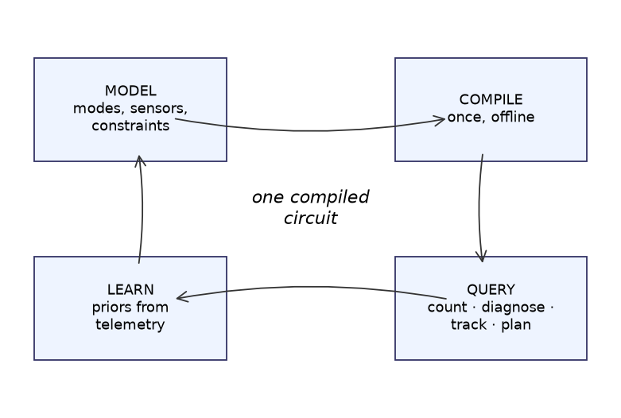

# Chapter 0 — What you're about to build

## Learning goals

- Know what this library does and why "compile once, ask many
  questions" is the central idea.
- Have a working installation you've verified.
- Run your first diagnosis and see a ranked answer.

## The pitch

Suppose you're building the software for a smart greenhouse: a pump, a
drip valve, a grow light, some cheap sensors. Things break. You want
your program to answer questions like:

- *The soil moisture reads dry but the light is fine — what's most
  likely broken?*
- *How sure are we? What else could it be?*
- *Which sensor should we check next to find out?*
- *Given a week of readings, is the pump wearing out?*
- *What commands get us back to a working state?*

You could write `if/else` rules for each case — until the cases start
interacting and the rule base rots. This library takes a different
route, one first flown on spacecraft: **describe the system once**
(components, their failure modes, how sensors relate to states), then
**compile** that description into a data structure called a circuit.
After compilation, every question above — and several you haven't
thought of yet — is answered *exactly* (real probabilities, not
heuristics) by fast, simple sweeps over the same compiled object.



The tutorial builds that greenhouse incrementally. By chapter 12 you'll
have the skills to do the same for a system *you* care about.

## Setup

```bash
git clone <this repo> && cd neximode
pip install -e .[torch,dev]     # torch is optional until chapter 10
python -m pytest -q             # ~290 tests should pass
```

## A 30-second taste

```python
from neximode import SystemModel, iff

m = SystemModel()
pump = m.mode("pump", ("ok", "weak", "dead"), priors=(0.90, 0.07, 0.03))
drip = m.bool("drip")
m.add(iff(drip, pump != "dead"))          # water drips unless the pump is dead
m.sensor("moist", drip, false_negative=0.1)   # noisy soil sensor

system = m.compile()                       # <- the one-time compile step
for d in system.map_diagnoses({"moist": False}, k=3):
    print(d)
```

Output (yours will match exactly — these are exact posteriors, not
samples):

```
Diagnosis(pump=ok; p=0.7087)
Diagnosis(pump=dead; p=0.2362)
Diagnosis(pump=weak; p=0.05512)
```

A dry reading is *evidence*, not proof: the sensor misses 10% of the
time, so a healthy pump with a sensor glitch is still the best
explanation — but "pump=dead" jumped from a 3% prior to a 24%
posterior. That's the kind of calibrated reasoning you get for free,
and by the end of this tutorial you'll know exactly where those numbers
come from (you'll be able to compute this one by hand).

## Checkpoint

*Why might "compile once, query many times" beat "search at question
time" for a system that must answer quickly and predictably?* (Hint:
what's the runtime of a query if the answer structure is prebuilt?
This mattered a lot on spacecraft.)

Next: [Chapter 1 — Worlds](01_worlds.md)
