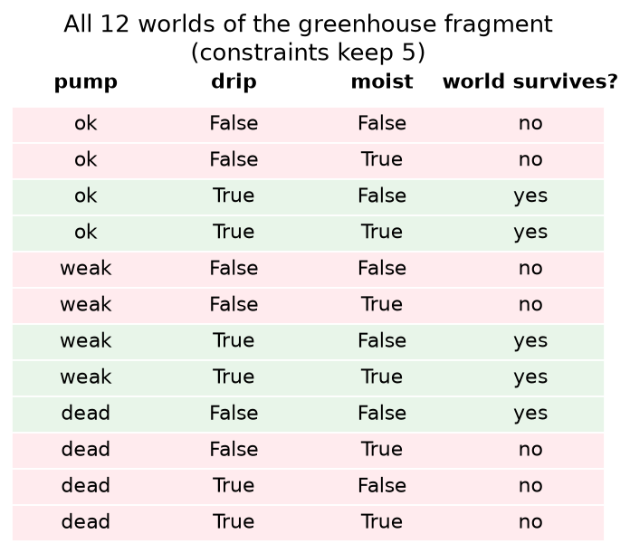
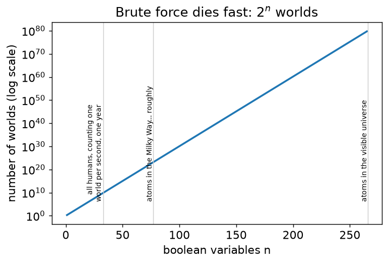

# Chapter 1 — Worlds: logic as possibility

## Learning goals

- Read a system description as a set of *surviving worlds*.
- Enumerate worlds by brute force and count models by hand.
- Feel, concretely, why brute force cannot scale — which is the entire
  motivation for the rest of this tutorial.

## Variables, worlds, constraints

Our greenhouse fragment has three variables:

- `pump` with **finite domain** `{ok, weak, dead}` — not just
  true/false; components have *modes*.
- `drip` — boolean: is water reaching the drip line?
- `moist` — boolean: is the soil moist? (Perfect sensor for now; noise
  comes in chapter 6.)

A **world** (logicians say *model*, we'll use both) is one complete
assignment: `pump=weak, drip=True, moist=False` is a world. With
domains of size 3, 2, 2 there are 3×2×2 = **12 possible worlds**.

Physics doesn't allow all of them. We believe two things:

1. Water drips **iff** the pump isn't dead: `drip ⟺ pump ≠ dead`.
2. Soil can only be moist if water reaches it: `moist ⟹ drip`.

A **constraint** is a filter on worlds. Here's the whole thing, no
library, just Python:

```python
from itertools import product

worlds = []
for pump, drip, moist in product(("ok", "weak", "dead"),
                                 (False, True), (False, True)):
    c1 = drip == (pump != "dead")
    c2 = (not moist) or drip
    if c1 and c2:
        worlds.append((pump, drip, moist))

for w in worlds:
    print(w)
print(len(worlds), "worlds survive")
```

```
('ok', True, False)
('ok', True, True)
('weak', True, False)
('weak', True, True)
('dead', False, False)
5 worlds survive
```

Worth pausing on the one that surprises people: `('ok', True, False)`
survives because constraint 2 is an implication, not an equivalence —
dry soil under a working drip is *allowed* (maybe it just started).
Constraints mean exactly what they say, never what you hoped.




Counting surviving worlds is called **model counting**, and it is the
foundational question — every fancier query in this tutorial
(probabilities, diagnoses, plans) is a *weighted or optimized variant*
of walking this list.

## The cliff

Twelve worlds is nothing. Real systems aren't:

| system | worlds |
|---|---|
| greenhouse fragment | 12 |
| full tutorial greenhouse (ch. 7) | ~10⁴ |
| 32-bit adder w/ per-gate fault modes (this repo's benchmark) | ~10⁹⁶ |
| 200-stage process line (also in this repo) | ~10²⁸⁰ |



The `for` loop above visits every world. At 60 variables it outlives
you. Yet this library answers exact queries about the 10²⁸⁰-world
system in milliseconds. Chapter 2 shows the trick.

## Exercises

1. Add a `light` boolean and a `bulb` mode `{ok, burnt_out}` with the
   constraint `light ⟺ bulb = ok` to the brute-force loop. Predict the
   world count before running. (Solution: `solutions/ch01.py`.)
2. Add the constraint `moist ⟹ light` ("we only water when the lamp
   is on" — bad horticulture, good logic practice). How many worlds
   now? Why did the count drop by exactly that much?
3. Write a function `count(constraints)` that takes a list of Python
   predicates and returns the surviving-world count. You have just
   written a (terrible) model counter; keep it — we'll use it to
   *check the library* in chapter 3.

## Checkpoint

*A friend says "just cache the brute-force count." Why doesn't caching
help when the **evidence** changes between queries?* (Think: how many
different evidence combinations are there?)

Next: [Chapter 2 — The compile trick](02_circuits.md)
