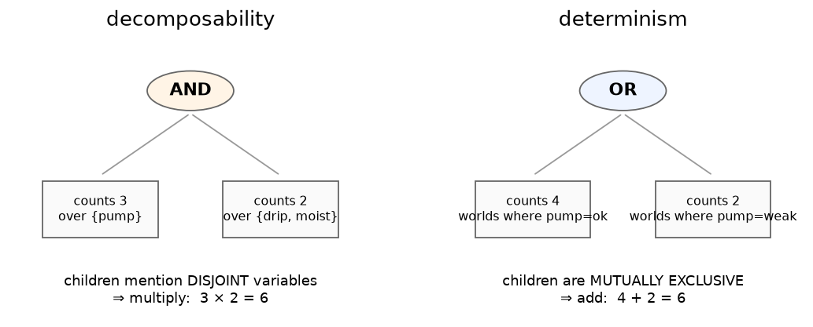
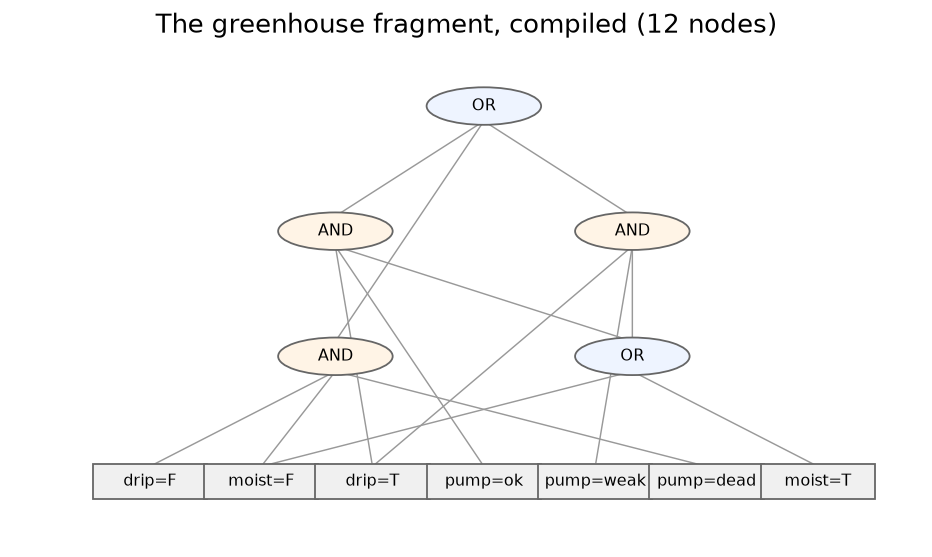

# Chapter 2 — The compile trick: circuits instead of tables

## Learning goals

- Explain why the brute-force loop repeats work, and how sharing fixes it.
- Recognize the two structural properties — **decomposability** and
  **determinism** — and say *why* each one licenses arithmetic.
- Count models on a small circuit by hand, without listing worlds.

## The waste in the loop

Watch the chapter-1 loop work. For `pump=ok` it enumerates the four
combinations of `(drip, moist)` and checks them. For `pump=weak` it
enumerates... the *same four combinations*, because `weak` and `ok`
behave identically here (both mean "not dead"). Brute force can't see
that; it re-derives the `(drip, moist)` sub-answer for every pump
value.

The fix is the oldest idea in computer science: **share repeated
subproblems**. Do the case split once — "pump dead" vs "pump not
dead" — solve the `(drip, moist)` subproblem once per case, and *point*
at the solution from everywhere it's needed. The result is not a table
but a **directed acyclic graph**:

- **leaves** are atomic statements: `pump=ok`, `drip=False`, ...
- **OR nodes** are case splits ("dead, or not dead")
- **AND nodes** are independent sub-answers glued together

This is a *circuit*, and compilation is the process of building a small
one automatically. (Chapter 11 shows how; for now, trust the compiler.)

## The two properties that make circuits computable

A DAG of ANDs and ORs is just a picture until you can *calculate* with
it. Two structural guarantees, maintained by the compiler, turn the
picture into a calculator:

**Decomposability** — the children of every AND node mention
**disjoint** sets of variables. One child talks about `pump`, the other
about `(drip, moist)`, and they share nothing. Independent choices
multiply: if the left child admits 3 partial worlds and the right
admits 2, the AND admits 3 × 2 = 6. *No enumeration — one
multiplication.*

**Determinism** — the children of every OR node are **mutually
exclusive**: no world satisfies two branches (one branch has
`pump=dead`, the other `pump≠dead`; no overlap possible). Exclusive
cases add: 4 worlds one way, 2 the other, 4 + 2 = 6 total. *No double
counting — one addition.*

Multiply at ANDs, add at ORs, read the answer at the root. Model
counting becomes **one bottom-up sweep**, linear in the size of the
circuit — regardless of how many worlds there are. The 10²⁸⁰-world
system from chapter 1 has a circuit of only 9,201 nodes; the sweep is
9,201 arithmetic operations.

(One technicality you'll meet in error messages: **smoothness**. For
the additions to come out right, both branches of an OR must mention
the same variables; the compiler pads any branch that's silent about a
variable with a "don't care" gadget. The library handles this when you
pass `smooth=True`, and the diagnosis layer always does it for you.)

## Your first real circuit

This is the actual compiled circuit for the chapter-1 fragment — every
figure in this tutorial is generated from the library, so this is not
a cartoon:

Trace it by hand, bottom to top, writing a count next to each node:

1. Every leaf counts **1** (it admits exactly one value of one variable).
2. The lower-right OR joins `pump=ok` and `pump=weak`: exclusive, so
   1 + 1 = **2** ("two ways to be not-dead").
3. Each AND multiplies its children's counts (their variable sets are
   disjoint — check!).
4. The root OR adds its branches.

You should reach **5** at the root — the same count your `for` loop
produced, obtained without visiting a single world. That hand-trace is
the whole technology in miniature; everything after this chapter is
just *changing what the leaves are worth*.

## Exercises

1. Do the hand-trace above and write the count at every node. (The
   chapter-4 figure has the answer key on its left panel.)
2. Suppose someone breaks determinism: an OR whose branches are
   `pump=ok` and `drip=True` (a world can satisfy both!). Show with a
   concrete world how add-at-OR now double counts.
3. Suppose someone breaks decomposability: an AND whose children both
   mention `drip`. Find two children counts whose product is wrong,
   and say why multiplication assumed independence.

## Checkpoint

*In one sentence each: what does decomposability license, and what does
determinism license?* (Multiplication without enumeration; addition
without double counting.)

Next: [Chapter 3 — First contact with the library](03_first_contact.md)
