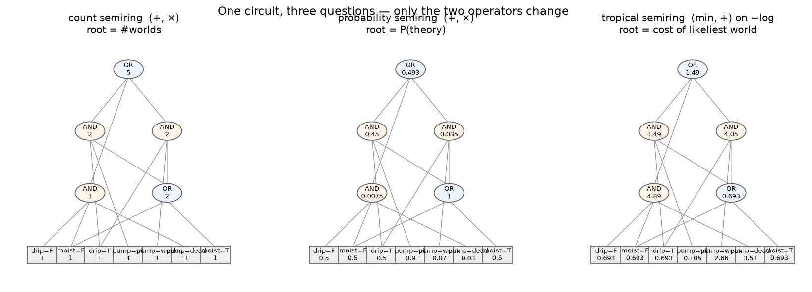
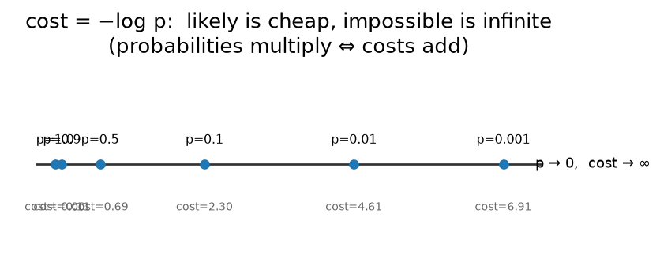

# Chapter 4 — One circuit, many questions: weights and semirings

## Learning goals

- Put weights on circuit leaves and understand what a weighted sweep
  computes.
- Explain the semiring idea: *swap the two operators, keep the
  circuit*.
- Convert between probabilities and neg-log costs fluently.

## From counting to weighing

Chapter 2's sweep gave every leaf the value 1 and computed
`#worlds = Σ_worlds Π_leaves 1`. Nothing in that sweep *required* the
ones. Give each leaf `var=value` a **weight** `w(var=value) ≥ 0` and
the identical multiply-at-AND, add-at-OR sweep computes

```
WMC  =  Σ (over surviving worlds)  Π (over that world's assignments)  w
```

the **weighted model count**. Choose the weights to be probabilities —
each variable's weights a distribution over its values — and WMC *is*
the probability that a random world (drawn per those distributions)
satisfies your constraints. Every leaf of the greenhouse circuit
already has a weight: your `priors=(0.90, 0.07, 0.03)` from chapter 3
went straight onto the `pump=…` leaves, and undeclared booleans sit at
weight 1 per value (chapter 3's subtlety).

The library's diagnosis queries are all ratios of such sweeps:

```python
# P(evidence) as a weighted sweep, via the diagnosis layer:
import math
print(math.exp(system.log_evidence({"moist": True})))    # 0.97
print(math.exp(system.log_evidence({"moist": False})))   # 1.0
# and a posterior is just a ratio of two sweeps:
print(system.posteriors({"moist": True}, names=["pump"]))
# {'pump': {'ok': 0.9278, 'weak': 0.0722, 'dead': 0.0}}
```

*0.97 + 1.0 ≠ 1 — chapter 3's subtlety, live: unweighted booleans
contribute weight 1 per value, so these sweeps are unnormalized mass,
not probabilities. Trace 0.97 by hand: worlds with `moist=True` are
(ok, drip, moist) and (weak, drip, moist), mass 0.90 + 0.07. The
`posteriors` call divides two sweeps, so it — and every headline
diagnosis query — is always properly normalized: 0.90/0.97 = 0.9278,
and `dead` is 0 because dead soil can't be moist.*

## The operator swap

Here is the idea that carries the rest of this tutorial. The sweep
uses two operations: one to *combine* independent parts (at ANDs), one
to *resolve* exclusive cases (at ORs). Different (combine, resolve)
pairs answer different questions **on the unchanged circuit**:

| resolve (OR) | combine (AND) | leaf value | root means |
|---|---|---|---|
| `+` | `×` | 1 | number of worlds |
| `+` | `×` | probability | probability of the theory |
| `max` | `×` | probability | probability of the *likeliest* world |
| `min` | `+` | **−log** probability | cost of the likeliest world |
| `or` | `and` | possible? | satisfiable at all? |

Such an (⊕, ⊗) pair is called a **semiring** (you now know the word;
you already understood the thing). One compiled artifact, five
questions — and more later: ranked enumeration (chapter 8) resolves
with "keep the k best," and learning (chapter 10) differentiates the
(+, ×) sweep.



The figure shows the real greenhouse circuit swept three ways, every
node annotated. Check one node of each kind by hand against the rule.

## The fourth row: why −log

Rows 3 and 4 of the table compute the same thing. Why prefer costs?
Numerics and intuition:

- Multiplying many probabilities underflows float64 fast
  (0.9^1000 ≈ 10⁻⁴⁶); adding their logs doesn't.
- `min` + `+` is the algebra of *shortest paths*: "most probable
  world" becomes "cheapest world," and impossibility is `∞` — an
  annihilator that conditioning can write into any leaf to forbid a
  value (that is literally how evidence works in this library).



```python
from dnnf import fd
import math

# min-sum sweep by hand: costs from the system's own weights
costs = system._conditioned_costs({})          # -log of every leaf weight
cost, world = fd.mpe(system.circuit, costs)
print(cost)                                    # 0.10536
print(math.exp(-cost))                         # 0.9
print(system._decode_state(world))
# {'pump': 'ok', 'drip': True, 'moist': False}
```

Cost 0.10536 is exactly `−log 0.9`: the pump leaf is the only weighted
leaf in the cheapest world (the booleans cost `−log 1 = 0`). Note
`moist=False` in the answer — `moist=True` ties at the same cost, and
min-sum returns *a* cheapest world, breaking ties arbitrarily. When
ties carry meaning, you want ranked enumeration (chapter 8), which
surfaces all of them. (`mpe` = "most probable explanation"; the
polished diagnosis version arrives next chapter — here you've seen
it's nothing but min-sum on the same circuit.)

## Exercises

1. By hand, compute the (+, ×) sweep value with all weights 1 for the
   circuit in the chapter-2 figure and confirm it equals the model
   count. Then set `w(moist=True) = 0` (i.e. *condition on dry soil*)
   and re-sweep by hand. What question did you just answer?
2. Verify the claim `0.9^1000` underflows: compare `0.9 ** 1000`
   with `1000 * math.log(0.9)`. Find the first `k` where `0.9 ** k`
   is exactly `0.0`. (Use `0.9 ** k`, *not* a running `p *= 0.9`
   loop — the loop never terminates, and figuring out why teaches
   you about denormal floats; see the solution file.)
3. Using only `fd.mpe` and cost surgery (set a leaf's cost to
   `math.inf`), find the *second* most probable world of the fragment.
   (Chapter 8 does this properly with `enumerate_models`; doing it
   crudely once teaches you what the proper tool automates.)

## Checkpoint

*Your teammate says: "we need one compiled structure for counting and
a different one for most-likely-world." What's the one-sentence
correction?*

Next: [Chapter 5 — Diagnosis](05_diagnosis.md)
