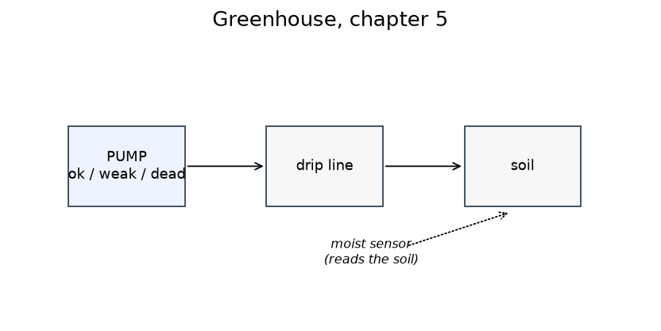
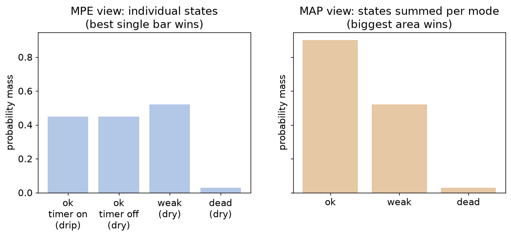
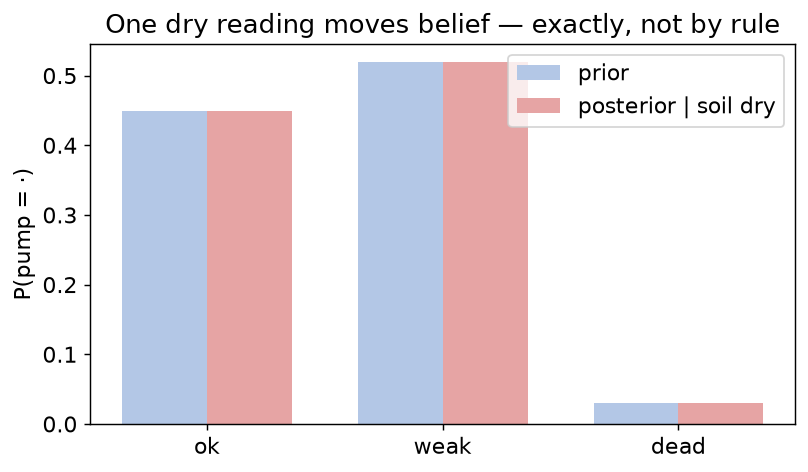

# Chapter 5 — Diagnosis: modes, priors, evidence

## Learning goals

- Declare diagnosable components and attach fault priors.
- Condition on evidence and read normalized posteriors.
- Explain, with a concrete case, the difference between "most probable
  single state" (MPE) and "most probable mode, all states summed"
  (marginal MAP) — and know which query answers which.

## The chapter's greenhouse



```python
from neximode import SystemModel, iff

m = SystemModel()
pump = m.mode("pump", ("ok", "weak", "dead"), priors=(0.45, 0.52, 0.03))
drip = m.bool("drip")
moist = m.bool("moist")
# weak or dead pumps can't push water; an OK pump drips whenever the
# irrigation timer opens — and we haven't modeled the timer, so under
# ok, drip is genuinely open: two ok-worlds survive.
m.add((pump == "weak") >> ~drip)
m.add((pump == "dead") >> ~drip)
m.add(iff(moist, drip))
system = m.compile()
```

(Yes, those priors say this pump is *usually* weak — it's a cheap pump.
They're rigged to make this chapter's punchline sharp; chapter 10
teaches you to learn honest priors from data.)

Worlds and their masses, by hand — with an unmodeled timer, `ok` gets
**two** worlds (chapter 3's rule: an unconstrained boolean counts once
per value):

| world | mass |
|---|---|
| ok, timer made it drip, moist | 0.45 |
| ok, timer off, dry | 0.45 |
| weak, dry | 0.52 |
| dead, dry | 0.03 |

## Two different "what's most likely?" questions

```python
print(system.diagnoses({}, k=2))      # ranked by best single STATE
# [Diagnosis(pump=weak; p=0.3586), Diagnosis(pump=ok; p=0.3103)]

print(system.map_diagnoses({}, k=2))  # ranked by SUMMED mode mass
# [Diagnosis(pump=ok; p=0.6207), Diagnosis(pump=weak; p=0.3586)]
```

**They disagree**, and both are right:

- `diagnoses` (MPE semantics) asks: *which complete world is most
  probable?* The single heaviest world is `weak, dry` (0.52 of 1.45
  total mass → 0.3586). No individual `ok` world beats it — `ok`'s
  mass is split across the two timer cases.
- `map_diagnoses` (marginal MAP) asks: *which mode value is most
  probable, summing over everything we don't care about?* `ok`'s two
  worlds together carry 0.90 of 1.45 → 0.6207. That's the actual
  probability the pump is fine.



Rule of thumb: **report `map_diagnoses` to humans** ("what's probably
wrong") — it's a true posterior over the thing you care about. Use
`diagnoses` when you need a *complete consistent state* (e.g. to feed
a simulator or to enumerate scenarios). When every non-mode variable
is determined by the modes and evidence, the two rankings coincide —
divergence is a signal that your model has real latent freedom.

## Now add evidence

```python
print(system.posteriors({"moist": False}))
# {'pump': {'ok': 0.45, 'weak': 0.52, 'dead': 0.03}}
```

Read that carefully: after observing dry soil, the posterior is
*exactly the prior*. Why? Dry soil kills only the `ok, drip` world;
each mode retains exactly one consistent world of mass = its prior, so
normalizing gives the priors back. Compare with what dryness did to
the *marginal* of ok: before observing, P(ok) was 0.6207; after,
0.45 — the reading genuinely lowered our confidence in the pump, by
exactly the mass of the world it excluded. Evidence in this framework
never "fires a rule"; it deletes worlds, and the arithmetic does the
rest.



## Exercises

1. Compute the 1.45 normalizer and both rankings by hand from the
   world table. Then observe `moist=True` and predict all three pump
   posteriors before running. (One of them is 1.0 — why?)
2. Add a `valve` mode `("ok", "stuck")`, priors `(0.95, 0.05)`, with
   `stuck` also forcing `~drip`. Does the MPE/MAP disagreement
   survive? Check, then explain.
3. Model *your own* two-component gadget (bike: chain/tire; laptop:
   battery/charger). One sensor. Verify one posterior by hand.

## Checkpoint

*Your monitoring UI shows users a single "most likely fault." A world
with many irrelevant unknowns (timers, weather) is being ranked down
because its probability is smeared across them. Which query fixes
this, and what does it sum over?*

Next: [Chapter 6 — Real sensors lie](06_noise.md)
