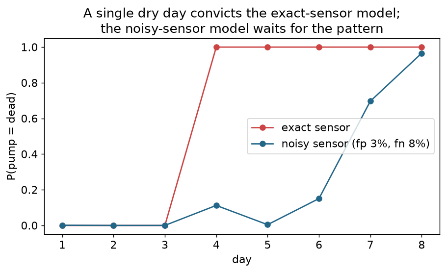
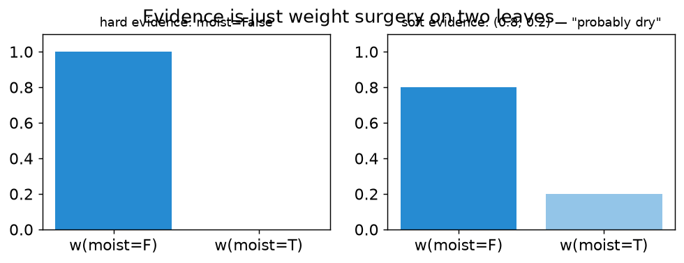

# Chapter 6 — Real sensors lie: noise and soft evidence

## Learning goals

- Declare noisy sensors with false-positive/negative rates and explain
  what they compile into.
- Use soft (virtual) evidence for detector confidences.
- Recognize the "posterior snap" pathology and fix it.

## The pathology

Chapter 5's `moist` was an *exact* sensor: `iff(moist, drip)`. Exact
sensors make brutal epistemics — watch what one dry reading does:

```python
from dnnf import SystemModel, iff

def build(noisy):
    m = SystemModel()
    pump = m.mode("pump", ("ok", "dead"), priors=(0.97, 0.03))
    drip = m.bool("drip")
    m.add(iff(drip, pump == "ok"))
    if noisy:
        m.sensor("moist", drip, false_positive=0.03, false_negative=0.08)
    else:
        m.add(iff(m.bool("moist"), drip))
    return m.compile()

print(build(False).posteriors({"moist": False})["pump"]["dead"])  # 1.0
print(build(True).posteriors({"moist": False})["pump"]["dead"])   # 0.2727
```

The exact model *convicts the pump outright* on one reading — a 3%
prior jumps to 100%, and a second reading of `True` would then be an
outright contradiction (probability zero, queries raise). The noisy
model says "27% — suspicious, keep watching," which is what you
actually believe. Hand-check it with Bayes — but carefully, because
there's a classic trap. A dry reading under a *dead* pump fails only
if the sensor false-*positives* (reports moisture that isn't there),
so P(dry | dead) = 1 − 0.03 = 0.97, and

    P(dead | dry) = 0.03·0.97 / (0.03·0.97 + 0.97·0.08) = 0.2727 ✓

If you instead grab the miss rate for that branch —
`0.03·0.92 / (0.03·0.92 + 0.97·0.08) = 0.2624` — you get a number
that's *plausibly close and wrong*, the most dangerous kind. Exercise
1 makes you find the error yourself. The compiled model can't make
this mistake: each glitch variable is attached to the exact branch it
belongs to by the constraint structure.



The figure runs both models through the same eight days of readings
with a slowly failing pump (tracking machinery from chapter 7): the
exact model slams to certainty on the first dry day — and *stays*
there even when moisture returns, because its beliefs became
contradictions; the noisy model rides the evidence.

## What `sensor()` compiles to

```
m.sensor("moist", drip, false_positive=0.03, false_negative=0.08)
```

is not a special runtime feature. It desugars into ordinary model
pieces: a hidden `_moist_fp` variable (prior 0.03), a hidden
`_moist_fn` variable (prior 0.08), and the constraint
`moist ⟺ (drip ∧ ¬fn) ∨ (¬drip ∧ fp)`. Noise is just *more model* —
two more variables whose posteriors you can even query
(`system.posteriors(evidence, names=["_moist_fp"])` tells you the
probability the sensor glitched). The hidden variables stay out of
your diagnosis reports automatically.

## Soft evidence: when the reading itself is a probability

Hard evidence says "moist is False, period." But suppose a vision
model looks at the soil and outputs 80% dry. Passing a **likelihood
vector** instead of a value:

```python
system = build(True)
print(system.posteriors({"moist": (0.8, 0.2)})["pump"]["dead"])
# value order is (False, True): L(reading|F)=0.8, L(reading|T)=0.2
```

This is Pearl's *virtual evidence*: the pair multiplies into the two
`moist` leaves — evidence is, and always was, weight surgery:



Two things to remember. Only the *ratio* matters (`(0.8, 0.2)` ≡
`(4, 1)`). And these are likelihoods `P(what-I-saw | value)`, **not**
"I believe moist=False with probability 0.8" — confusing the two is
the classic soft-evidence bug (asserting a posterior is a different
operation, Jeffrey's rule, which this library deliberately doesn't
provide).

## Continuous readings: quantize

```python
m2 = SystemModel()
leak = m2.mode("leak", ("none", "small", "large"), priors=(0.9, 0.08, 0.02))
level = m2.quantized("level", (0.0, 10.0, 50.0, 100.0))
m2.add((leak == "large") >> level.below(10.0))
m2.add((leak == "small") >> level.between(10.0, 50.0))
m2.add((leak == "none") >> level.at_least(50.0))
sys2 = m2.compile()
print(sys2.map_diagnoses({"level": 37.2}, k=1)[0].modes)   # {'leak': 'small'}
```

A `quantized` variable is a finite-domain variable over intervals;
threshold atoms (`below`, `at_least`, `between`) are single circuit
leaves, and numeric evidence buckets itself. Choose boundaries where
your *constraints* need to distinguish — not finer. Every extra bucket
costs circuit size and buys nothing unless some constraint or query
can tell the buckets apart.

## Exercises

1. Without looking at the text above, compute P(dead | dry) by
   Bayes from the rates fp=0.03, fn=0.08 — then check yourself
   against 0.2727. If you got 0.2624, identify which branch you
   applied the wrong rate to, and say in one sentence why
   P(dry | dead) involves the false-positive rate, not the miss
   rate. (Solution: `solutions/ch06.py`.)
2. Sweep the soft-evidence ratio from `(0.5, 0.5)` to `(0.99, 0.01)`
   and plot P(dead). Where does soft evidence with ratio `(1, 0)`
   land, and what hard statement is it equivalent to?
3. In the leak model, observe `level=5.0` and get the posterior over
   `leak`. Then make the level sensor *noisy* — the pattern from this
   chapter works for quantized observables too if you route it through
   a boolean (model `reading_low = sensor(level.below(10.0), ...)`).

## Checkpoint

*A teammate hard-codes `moist=False` from a sensor with a known 8%
miss rate, and the system starts producing zero-probability errors on
contradictory streams. Explain the failure in one sentence and the
one-line fix.*

Next: [Chapter 7 — Time](07_tracking.md)
