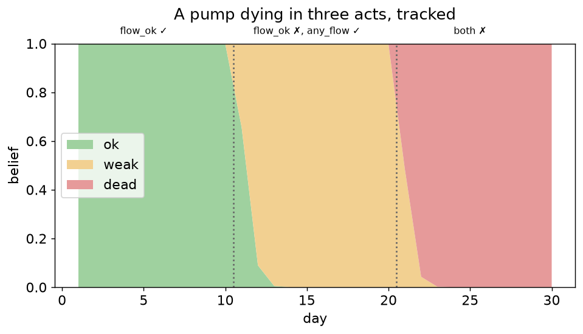

# Chapter 7 — Time: tracking a changing system

## Learning goals

- Give modes *dynamics* with transition matrices and step a belief
  through observations.
- Read a belief timeline and explain each shift.
- Know the beam caveat: when the tracker is exact and when it
  approximates.

## From snapshot to film

Everything so far diagnosed a single instant. Real components *drift*:
a pump is ok for months, weak for weeks, then dead — and dead pumps do
not resurrect. That's a probabilistic statement about *pairs of
consecutive days*, written as a transition matrix per mode variable:

```python
from neximode import ModeTracker, SystemModel

m = SystemModel()
pump = m.mode("pump", ("ok", "weak", "dead"), priors=(1.0, 0.0, 0.0))
m.sensor("flow_ok", pump == "ok", false_positive=0.05, false_negative=0.05)
m.sensor("any_flow", pump != "dead", false_positive=0.05, false_negative=0.05)
system = m.compile()

TRANS = {"pump": {
    "ok":   {"ok": 0.97, "weak": 0.025, "dead": 0.005},
    "weak": {"weak": 0.95, "dead": 0.05, "ok": 0.0},   # no self-repair
    "dead": {"dead": 1.0,  "ok": 0.0,   "weak": 0.0},  # absorbing
}}

tracker = ModeTracker(system, TRANS, beam=3)
```

Note the zeros: `weak → ok` is impossible (pumps don't heal), `dead`
is absorbing. Structure lives in the zeros as much as in the rates.
Two sensors because one wouldn't separate the three modes: `flow_ok`
distinguishes ok from the rest, `any_flow` distinguishes dead.

## A pump dies in three acts

Feed the tracker thirty days: ten healthy, ten with weak-looking flow,
ten with none.

```python
days = ([{"flow_ok": True,  "any_flow": True}] * 10
      + [{"flow_ok": False, "any_flow": True}] * 10
      + [{"flow_ok": False, "any_flow": False}] * 10)
for ev in days:
    tracker.step(ev)
print({k: round(v, 3) for k, v in tracker.marginals()["pump"].items()})
# {'ok': 0.0, 'weak': 0.0, 'dead': 1.0}
```



Read the figure like a clinician:

- **Days 1–10**: belief hugs `ok` (0.999 at day 10) — but never quite
  1.0. The transition model *continuously leaks* a little probability
  toward `weak`; observations keep pulling it back. That equilibrium
  gap is the tracker honestly pricing "it could have failed this
  morning."
- **Day 11**: one `flow_ok=False` reading. Belief doesn't snap — 5%
  sensor noise and yesterday's strong prior fight back — but two or
  three consistent days overwhelm noise (day 20: weak at 0.997). The
  chapter-6 lesson, now with dynamics: *patterns convict, single
  readings suggest.*
- **Day 21 on**: `any_flow` goes false too, and belief moves to `dead`
  (1.000 by day 30) — and stays, forever, because the matrix says
  dead is absorbing. If a moist reading arrived on day 31, the tracker
  would blame the *sensor*, exactly as it should.

Under the hood each step is: for every believed mode, push it through
the transition row (that becomes the day's prior), condition the
*same compiled circuit* on the day's evidence, renormalize. No new
inference machinery — chapter 5's queries in a loop.

## The beam, honestly

`beam=3` keeps the 3 most probable mode assignments. With one
3-valued mode, that's *everything* — the tracker is **exact HMM
filtering** (the library's tests verify this against a hand-rolled
filter). With 10 components of 3 modes each, the joint space is 3¹⁰ ≈
59k and a beam of 20 is an approximation: mass outside the beam is
dropped and renormalized. That's usually fine (belief concentrates
fast) with two warnings: a fault combination that was *never* in the
beam can't be believed later without re-entering through a transition;
and if evidence contradicts every tracked assignment, `step` raises
rather than silently inventing mass — enlarge the beam or check the
model.

## Sharper dynamics (pointers)

Three upgrades when your project needs them, all tested in the repo:
per-step overrides — `tracker.step(ev, transitions=...)` for
command-conditioned risk ("the valve only risks sticking on days you
actuate it"); `transition_fn=lambda prev: ...` for correlated wear
("once the pump is dead, the backup's failure rate triples"); and
`m.prev("pump")` for *hard* inter-step constraints compiled into the
circuit itself (chapter 9's machinery).

## Exercises

1. Rerun the 30 days with `false_positive=false_negative=0.20`. How
   many dry days does conviction now take? Plot both timelines.
2. Change `weak→dead` to 0.5. Predict how the day-20 belief changes
   before running.
3. Break it on purpose: set the `ok` row to `{"ok": 1.0}` (never
   fails) and replay the same 30 days. What happens on day 11, and
   why is the error message the *right* behavior? (Then fix it with
   `beam` vs with the matrix — which is correct here?)

## Checkpoint

*Your tracker believes `dead` with probability 1.0 and a technician
replaces the pump. What do you do to the tracker, and why can't the
transition matrix fix it alone?* (Hint: the matrix says absorbing;
reality just changed the hardware. Think `ModeTracker(...)` fresh, or
a `replaced` command with its own transition row.)

Next: [Chapter 8 — Explanations](08_explanations.md)
