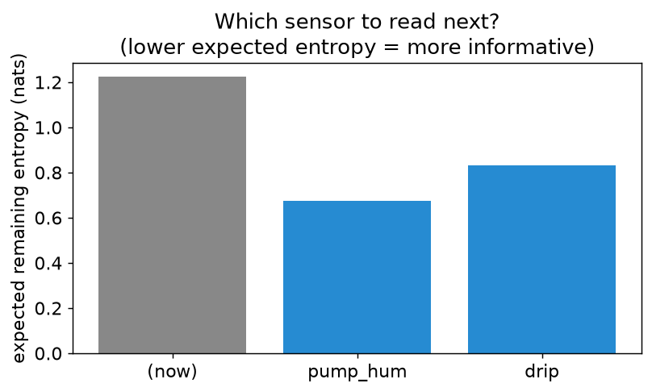

# Chapter 8 — Explanations: ranked worlds and what to check next

## Learning goals

- Enumerate explanations most-probable-first, lazily.
- Get fewest-faults-first diagnoses (minimum cardinality).
- Rank the *next observation* by expected information gain (VOI).

## The troubleshooting loop

A diagnosis that ends with "P(pump=dead) = 0.27" isn't an ending —
a technician asks *"so what do I check?"* This chapter's three tools
turn posteriors into procedure:

```
   diagnose  →  rank explanations  →  pick the best next observation
      ↑                                              |
      └────────────── observe it ────────────────────┘
```

Model for the chapter — two components, two sensors:

```python
from modenexus import SystemModel, iff

m = SystemModel()
pump = m.mode("pump", ("ok", "dead"), priors=(0.97, 0.03))
valve = m.mode("valve", ("ok", "stuck"), priors=(0.95, 0.05))
drip = m.bool("drip")
m.add(iff(drip, (pump == "ok") & (valve == "ok")))
m.sensor("moist", drip, false_negative=0.05)
m.sensor("pump_hum", pump == "ok", false_positive=0.02, false_negative=0.02)
system = m.compile()
```

The soil reads dry. Now what?

## Fewest faults first

```python
print(system.diagnoses_min_cardinality({"moist": False}, k=4))
# [(0, {'pump': 'ok',   'valve': 'ok'}),
#  (1, {'pump': 'dead', 'valve': 'ok'}),
#  (1, {'pump': 'ok',   'valve': 'stuck'}),
#  (2, {'pump': 'dead', 'valve': 'stuck'})]
```

Ranked by *number of broken things*, not probability: zero faults
(the sensor missed — possible, it has a 5% miss rate), then each
single fault, then the double. This is the classic diagnosis
ordering — technicians think in fault counts, and "check the
single-fault hypotheses before entertaining coincidences" is Occam
operationalized. Under the hood it's chapter 4 again: the min-sum
sweep with cost 1 per non-nominal mode value instead of −log prior.
(Compare with `map_diagnoses` on the same evidence — probability and
cardinality usually agree on the leaders and diverge in the tail;
when they disagree *at the top*, your priors are telling you a
coincidence is likelier than a rare single fault, which is worth
noticing.)

## Which sensor is worth reading?

Two candidates we haven't looked at: `pump_hum` (is the pump
humming?) and the `drip` line itself. Intuition says the hum isolates
the pump directly. Quantify it:

```python
print(system.value_of_information({"moist": False}))
# [('pump_hum', 0.5515), ('drip', 0.3936)]
```

`value_of_information` computes, for each unobserved variable, the
expected drop in diagnosis entropy if you observed it — averaging
over what the observation *might* say, weighted by how likely each
answer is given everything so far. Bigger is better; zero means "that
reading cannot change your mind" (the library returns exactly 0.0
when evidence already determines the modes — try it after observing
everything).



So: listen for the hum first. One `step` of the loop later, the
picture usually collapses — and VOI re-ranked on the new evidence
tells you whether to bother with a second check.

## All explanations, in order, lazily

Behind both tools sits the enumerator — every consistent world,
most probable first, generated on demand:

```python
from modenexus import fd
costs = system._conditioned_costs({"moist": False})
for i, (cost, world) in enumerate(fd.enumerate_models(system.circuit, costs)):
    print(round(cost, 3), system._decode_state(world))
    if i == 2:
        break
```

"Lazily" is load-bearing: asking for the top 3 does *not* enumerate
the rest (there can be astronomically many). The k-th world costs
incremental heap work on top of the (k−1)-th — this is the machinery
your NASA-era predecessors used to stream diagnoses to operators in
real time, and it's the same min-sum semiring from chapter 4 with
"keep the k best" as the resolve operation.

## Exercises

1. After hearing the hum (`pump_hum=True`), re-run all three tools.
   Which explanation is now on top, what does VOI say to check next,
   and — the real question — *when do you stop checking?* Propose a
   stopping rule in one sentence.
2. Make the pump enormously reliable (prior 0.999) and the valve
   flaky (0.80). Find evidence where min-cardinality and
   `map_diagnoses` disagree about the *top* explanation, and defend
   each ranking's logic.
3. VOI here uses each mode's marginal entropy. Construct a two-mode
   case where an observation has zero effect on either marginal but
   *does* change the joint (hint: XOR-style coupling), and check what
   `value_of_information` reports. What does this teach about the
   difference between marginal and joint uncertainty?

## Checkpoint

*Your UI can afford to ask the user to check exactly one thing. In one
sentence: why is "the variable with the highest VOI" a better choice
than "the variable in the most probable failing diagnosis"?*

Next: [Chapter 9 — Planning](09_planning.md)
